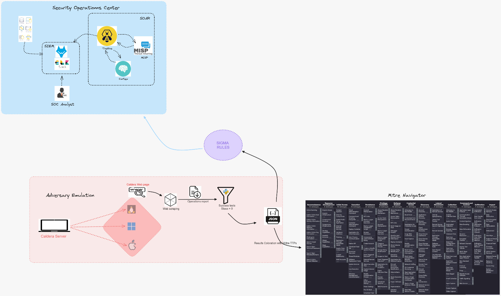

# mini-soc

## Présentation du projet

Bienvenue dans le projet **SOC-as-a-Code** ! Ce projet a pour objectif de créer un modèle de SOC (Security Operations Center) en tant que Code, entièrement basé sur des outils Open Source.
Il est conçu pour permettre aux analystes de sécurité et à tous ceux qui souhaitent explorer et de mettre en œuvre une architecture SOC moderne.

En intégrant des solutions [**SIEM**](https://www.varonis.com/fr/blog/quest-ce-quun-siem-guide-du-debutant) et [**SOAR**](https://www.elastic.co/fr/what-is/soar), ce projet offre une supervision complète et automatisée des systèmes d'information.
De plus, il propose une amélioration continue du SOC grâce à l'émulation réaliste d'attaques, rendant votre environnement toujours plus résilient face aux menaces.

### Cas d'utilisation

Ce projet est conçu pour répondre aux cas d'utilisation suivants :

- **Collecte des données** en un seul endroit pour une gestion centralisée.
- **Normalisation et analyse des données** pour une meilleure compréhension des menaces.
- **Visualisation des données** et préparation d'analyses de sécurité significatives.
- **Création des cas d'incidents** à partir des alertes de sécurité basées sur les données/journaux collectés.
- **Emulation des attaques ciblées** via [**Mitre Caldera**](https://github.com/mitre/caldera)
- **Réponse active** aux menaces
- **Création des règles de détection** via [**sigma-cli**](https://github.com/SigmaHQ/sigma-cli)
- **Coloration de la matrice** [**Mitre ATT&CK Navigator**](https://mitre-attack.github.io/attack-navigator/) via python

# Architecture projet

# Exigences d'installation

| **Ports** | **Plages IP** | **Commentaires** | **Identifiants par défauts** |
| --- | --- | --- | --- |
| **22** | IP du SOAR | Activer le SSH sur la machine hébergeant le SOAR |  |
| **443** | IP du SOAR | Accès à l'interface utilisateur de **MISP** | **admin@admin.test** : **admin** |
| **443** | IP du SIEM | Accès à **WAZUH** via le navigateur. (Si le **SIEM WAZUH** est déployé par l’utilisateur) | **admin** : **admin** |
| **5601** | IP du SIEM | Accès à l'interface utilisateur de **KIBANA.** (Si le **SIEM ELK** est déployé par l’utilisateur) | Générés aléatoirement lors de l’installation de **ELK** |
| **8888** | IP du SIEM | Accès à l'interface utilisateur de **CALDERA** | **red** : **nxokrsBxiDJnEhfNndx4kJ8lObUrrL-ud9AOCIncyzc** |
| **9000** | IP du SOAR | Accès à l'interface utilisateur de **TheHive** | **admin@thehive.local** : **secret** |
| **9001** | IP du SOAR | Accès à l'interface utilisateur de **CORTEX** | Créés par l’utilisateur |
| **9000** | IP du SOAR | Accès à l'interface utilisateur de **TheHive** | **admin@thehive.local** : **secret** |
| **9200** | IP du SIEM | Accès à **ElasticSearch.** (Si le **SIEM ELK** est déployé par l’utilisateur) | Générés aléatoirement lors de l’installation de **ELK** |

# Déploiement du SOC

# Déploiement du SOAR
